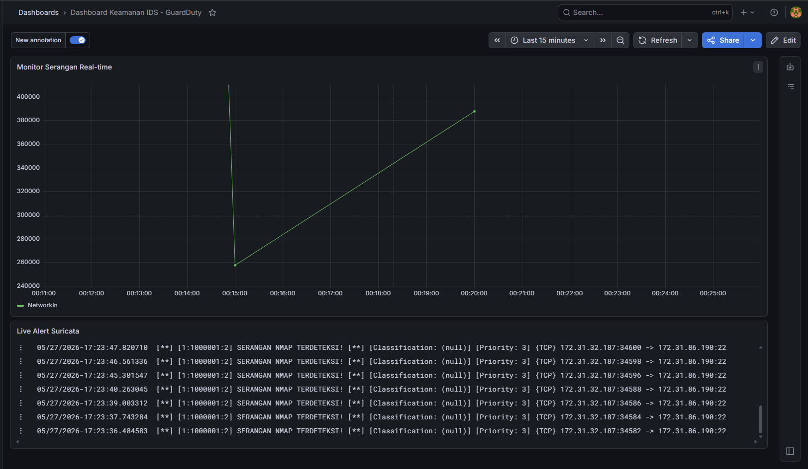
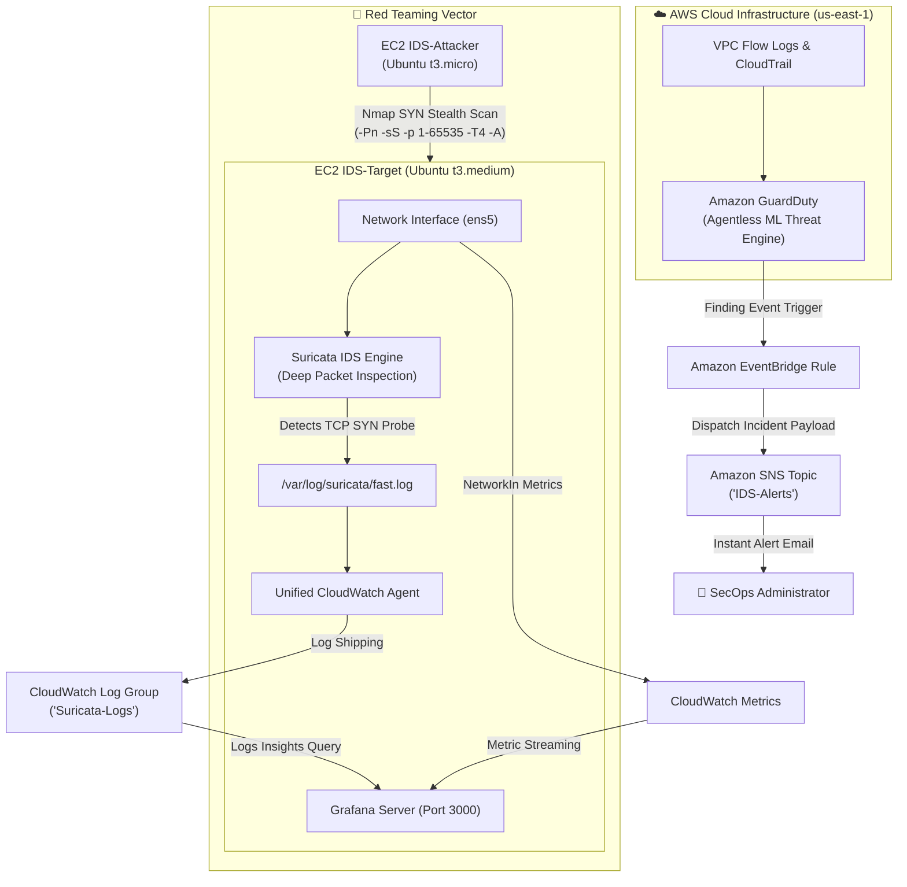
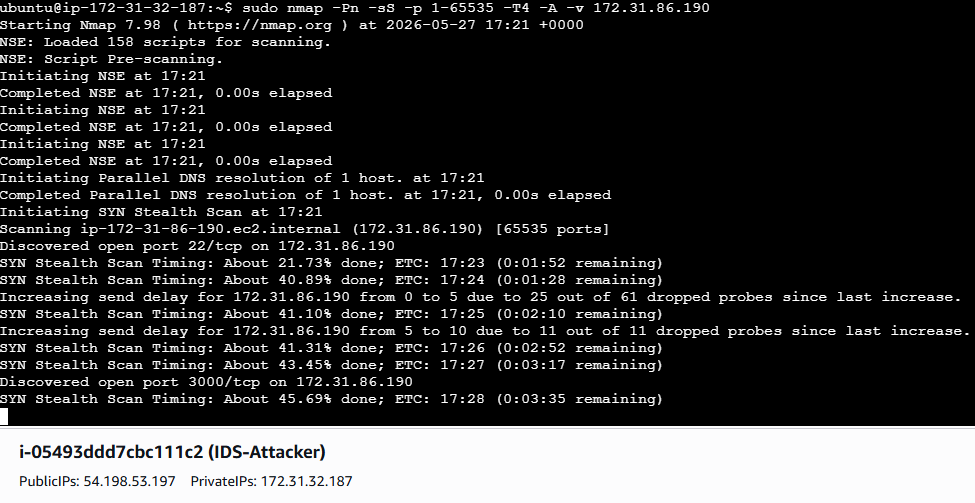
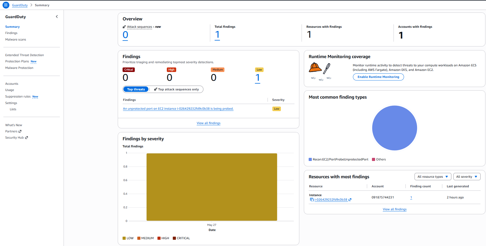
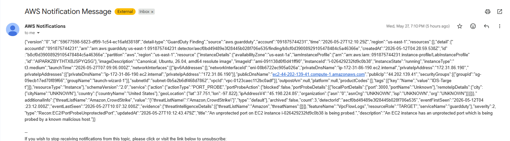
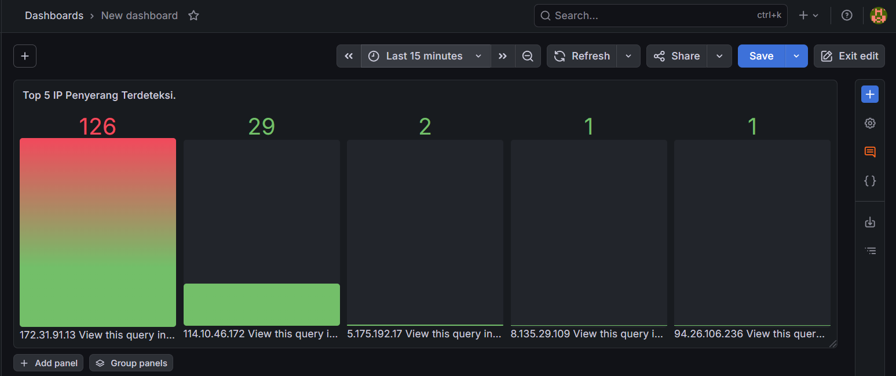

# 🛡️ Dual-Layer Cloud Intrusion Detection System (IDS) on AWS with Suricata, GuardDuty & Grafana

<p align="center">
  
</p>

<p align="center">
  
  
  
  
  
  
  
  
  
</p>

---

## 📌 Executive Summary

Modern cloud workloads face relentless automated reconnaissance, brute-force incursions, and sophisticated port probing. Relying solely on either boundary perimeter firewalls or localized host logging leaves dangerous visibility gaps. 

This project implements an enterprise-grade **Defense in Depth (DiD)** Intrusion Detection System (IDS) on **Amazon Web Services (AWS)** that seamlessly unifies two complementary threat detection paradigms:

1. **Cloud-Native Perimeter Intelligence (Agentless)**: **Amazon GuardDuty** continuously monitors VPC Flow Logs, DNS logs, and AWS CloudTrail management events using machine learning anomaly detection without consuming host compute.
2. **Host-Based Deep Packet Inspection (HIDS)**: **Suricata IDS** executes kernel-level signature matching directly on the target instance's network interface (`ens5`), detecting aggressive TCP SYN probes in real time.
3. **Automated Incident Notification Pipeline**: **Amazon EventBridge** intercepts high-fidelity GuardDuty findings and instantly dispatches actionable JSON incident payloads to security operators via **Amazon SNS**.
4. **Unified Observability & Analytics**: **Unified CloudWatch Agent** streams localized Suricata logs (`fast.log`) into AWS CloudWatch, where a centralized **Grafana** dashboard visualizes real-time network throughput surges alongside a **Top 5 Attacker IP Bar Gauge**.

---

## 🏛️ System Architecture & Threat Pipeline



### Detection Pipeline Workflow

1. **Host-Level Ingress**: Inbound packets hitting the EC2 target are mirrored to Suricata via `af-packet` on `ens5`. If signature rules match, an alert is written to `/var/log/suricata/fast.log`.
2. **Telemetry Log Shipping**: The CloudWatch Agent monitors `fast.log`, immediately shipping new records into the `Suricata-Logs` log group.
3. **Cloud-Native Ingress**: Independent of host OS operations, AWS hypervisor-level VPC Flow Logs are analyzed by GuardDuty. When suspicious port sweep patterns emerge, GuardDuty generates a `Recon:EC2/PortProbeUnprotectedPort` finding.
4. **Event Routing & Alerting**: EventBridge captures the finding and publishes it to Amazon SNS, delivering email notifications containing full target and attacker metadata within seconds.
5. **Security Dashboard**: Grafana pulls CloudWatch metrics (`NetworkIn`) to display traffic spikes while executing CloudWatch Logs Insights queries to rank attacker IP addresses.

---

## 🔬 Detection Engines & Configuration Deep Dive

### 1. Suricata Custom Signature & Threshold Tuning

To detect automated port reconnaissance while preventing log flooding, a custom signature was engineered and tuned in [`rules/local.rules`](rules/local.rules):

```suricata
alert tcp any any -> 172.31.86.190 any (msg:"SERANGAN NMAP TERDETEKSI!"; flags:S; threshold: type limit, track by_src, count 5, seconds 10; sid:1000001; rev:2;)
```

* **`flags:S`**: Targets raw TCP SYN packets (the hallmark of stealth half-open SYN scans).
* **`threshold: type limit, track by_src, count 5, seconds 10`**: **Critical Rate-Limiting Parameter**. Suppresses alert spam by logging at most 5 alerts per source IP address within a 10-second window, preventing disk exhaustion and CloudWatch ingestion cost spikes.
* **`sid:1000001`**: Custom local signature identifier.

### 2. Unified CloudWatch Agent Integration

The agent configuration in [`config/amazon-cloudwatch-agent.json`](config/amazon-cloudwatch-agent.json) instructs AWS to stream Suricata alerts directly to CloudWatch Logs:

```json
{
  "logs": {
    "logs_collected": {
      "files": {
        "collect_list": [
          {
            "file_path": "/var/log/suricata/fast.log",
            "log_group_name": "Suricata-Logs",
            "log_stream_name": "{instance_id}"
          }
        ]
      }
    }
  }
}
```

### 3. Amazon EventBridge Event Pattern

EventBridge routes GuardDuty findings to Amazon SNS using the following event pattern:

```json
{
  "source": ["aws.guardduty"],
  "detail-type": ["GuardDuty Finding"]
}
```

---

## 🧪 Red Teaming Simulation & Detection Validation

To rigorously validate the detection pipeline, an isolated attack simulation was executed from the **`IDS-Attacker`** EC2 instance (`172.31.32.187`) targeting **`IDS-Target`** (`172.31.86.190`).

<p align="center">
  
</p>

### Attack Execution Command

```bash
sudo nmap -Pn -sS -p 1-65535 -T4 -A -v 172.31.86.190
```

* **`-Pn`**: Bypass ICMP echo discovery (treat target as online).
* **`-sS`**: TCP SYN stealth scan (half-open scanning to avoid handshake completion).
* **`-p 1-65535`**: Full port sweep across all 65,535 TCP ports.
* **`-T4`**: Aggressive timing template for rapid packet dispatch.
* **`-A`**: OS detection, version scanning, and script scanning.

---

## 📈 Detection Results & Observability

### 1. Amazon GuardDuty Detection

GuardDuty identified the attack vector and classified the incident as a **Port Probe Reconnaissance**:

<p align="center">
  
</p>

* **Finding Type**: `Recon:EC2/PortProbeUnprotectedPort`
* **Severity**: `Low` (Initial Reconnaissance Phase)
* **Evidence**: Threat Intelligence corroborated by VPC Flow Logs analysis.

### 2. Amazon SNS Instant Email Notification

Within seconds of GuardDuty flag generation, EventBridge triggered an automated notification to the administrator via Amazon SNS:

<p align="center">
  
</p>

The email payload contains full incident metadata:
* **Target Instance ID**: `i-026429232fd9c0b38`
* **Target Private IP**: `172.31.86.190`
* **Probed Port**: `3000` (Grafana)
* **Threat Classification**: Port probe initiated against an exposed port.

### 3. Grafana Real-Time Security Operations Dashboard

The Grafana dashboard consolidates host and cloud telemetry into a unified pane of glass:

<p align="center">
  
</p>

* **Top Panel (`Monitor Serangan Real-time`)**: Displays a sharp spike in incoming bytes (`NetworkIn` metric from AWS CloudWatch) coinciding with the Nmap scan arrival.
* **Bottom Panel (`Live Alert Suricata`)**: Live tail of `/var/log/suricata/fast.log` highlighting signature matches:
  ```text
  [**] [1:1000001:2] SERANGAN NMAP TERDETEKSI! [**] [Priority: 3] {TCP} 172.31.32.187 -> 172.31.86.190:22
  ```

### 4. Attacker IP Analytics (CloudWatch Logs Insights)

A dynamic **Bar Gauge** panel queries CloudWatch Logs Insights to parse, aggregate, and rank malicious source IPs:

<p align="center">
  
</p>

#### CloudWatch Logs Insights Query

```sql
fields @timestamp, @message
| parse @message "* SERANGAN NMAP TERDETEKSI! * {TCP} *:* -> *" as pre, mid, src_ip, src_port, dst
| stats count(*) as total_serangan by src_ip
| sort total_serangan desc
| limit 5
```

---

## 📂 Repository Structure

```text
Cloud-IDS-AWS-GuardDuty/
├── config/
│   ├── amazon-cloudwatch-agent.json  # Unified CloudWatch Agent log-shipping configuration
│   └── suricata.yaml                 # Suricata network interface & rule path configuration
├── docs/                             # Architecture diagrams, dashboard screenshots, and logs
│   ├── grafana_live_dashboard.png
│   ├── grafana_top_attackers_gauge.png
│   ├── aws_guardduty_findings.png
│   ├── aws_sns_alert_email.png
│   └── red_teaming_nmap_attack.png
├── rules/
│   └── local.rules                   # Tuned Suricata TCP SYN detection signature
├── scripts/
│   ├── setup_ids.sh                  # Automated provisioning for Suricata & CloudWatch Agent
│   └── setup_grafana.sh              # Automated installation & service startup for Grafana
├── .gitignore                        # Git ignore rules for logs, keys, and temp files
├── LICENSE                           # MIT Open Source License
└── README.md                         # Comprehensive architecture & operational documentation
```

---

## 🚀 Step-by-Step Deployment Guide

### Phase 1: AWS Infrastructure Provisioning

1. Launch **`IDS-Target`** EC2 Instance:
   * **AMI**: Ubuntu Server 22.04 LTS (x86_64)
   * **Instance Type**: `t3.medium` (recommended for DPI and Grafana)
   * **IAM Role**: Attach role with `CloudWatchAgentServerPolicy`
   * **Security Group Inbound**: Port `22` (SSH) and Port `3000` (Grafana Web UI)
2. Launch **`IDS-Attacker`** EC2 Instance:
   * **AMI**: Ubuntu Server 22.04 LTS
   * **Instance Type**: `t3.micro`
   * **Security Group Inbound**: Port `22` (SSH)
3. Enable **Amazon GuardDuty**:
   * Navigate to AWS GuardDuty Console → Click **Enable GuardDuty**.

### Phase 2: Host IDS & Log Shipping Setup

SSH into the **`IDS-Target`** instance:

```bash
# Clone the repository
git clone https://github.com/KyuraNyx/Cloud-IDS-AWS-GuardDuty.git
cd Cloud-IDS-AWS-GuardDuty

# Run automated IDS installer
chmod +x scripts/*.sh
./scripts/setup_ids.sh

# Apply custom detection rule
sudo cp rules/local.rules /etc/suricata/rules/local.rules

# Update network interface in suricata.yaml to ens5
sudo cp config/suricata.yaml /etc/suricata/suricata.yaml

# Restart Suricata
sudo systemctl restart suricata
sudo systemctl status suricata

# Apply CloudWatch Agent configuration
sudo /opt/aws/amazon-cloudwatch-agent/bin/amazon-cloudwatch-agent-ctl \
  -a fetch-config \
  -m ec2 \
  -s \
  -c file:config/amazon-cloudwatch-agent.json
```

### Phase 3: Notification Pipeline Setup (EventBridge & SNS)

1. **Amazon SNS**:
   * Create a Standard Topic: `IDS-Alerts`.
   * Create a Subscription with Protocol: `Email` → Enter administrator email → Confirm subscription from inbox.
2. **Amazon EventBridge**:
   * Create a new Rule: `GuardDuty-To-SNS`.
   * Event Source: `AWS events or EventBridge partner events`.
   * Event Pattern:
     ```json
     {
       "source": ["aws.guardduty"],
       "detail-type": ["GuardDuty Finding"]
     }
     ```
   * Target: Select **SNS topic** → Choose `IDS-Alerts`.

### Phase 4: Grafana Visualizer Setup

1. Run the Grafana setup script on `IDS-Target`:
   ```bash
   ./scripts/setup_grafana.sh
   ```
2. Access Grafana in browser: `http://<TARGET_PUBLIC_IP>:3000` *(Default login: `admin` / `admin`)*.
3. Add **CloudWatch Data Source**:
   * Auth Provider: **AWS SDK Default / IAM Role**.
   * Default Region: `us-east-1`.
4. Create Panels:
   * **Metric Graph Panel**: Query `AWS/EC2` → Metric `NetworkIn` → Dimension `InstanceId`.
   * **Logs Panel**: Query CloudWatch Logs → Log Group `Suricata-Logs`.
   * **Bar Gauge Panel**: Query CloudWatch Logs Insights with the ranking query provided above.

---

## 👥 Authors & Contributors

* **Hayqal Husein Alhabsyi**
* **Made Nugraha Pradnyana**
* **Faris Arinanta**
* **Syarief Choirul Anwar**

---

## 📄 License

This project is licensed under the **MIT License** — see the [LICENSE](LICENSE) file for complete details.
